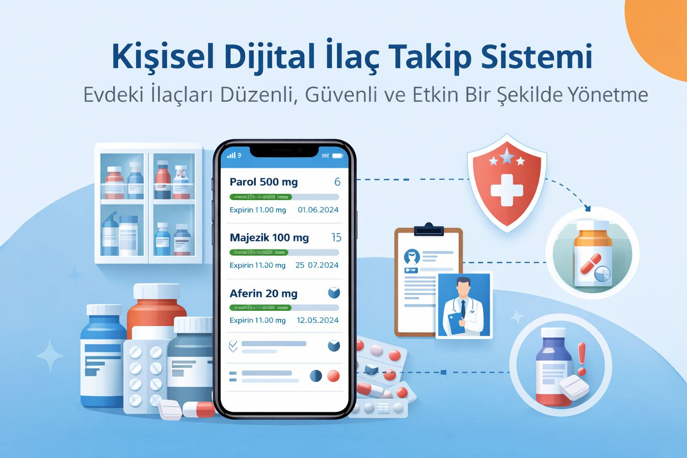

# E-RECETE
---

## Proje Hakkında

**Proje Tanımı:** 
Evde bulunan ilaçların düzenli bir şekilde takip edilmesini sağlayan bu sistem, kullanıcıların kendi kişisel dijital ilaç dolaplarını oluşturmalarına yardımcı olmak amacıyla tasarlanmıştır. Kullanıcılar, ellerinde bulunan ilaçların sayısını, bir kutu içerisindeki adet bilgisini ve son kullanma tarihlerini sisteme girerek ilaçlarını kolayca kayıt altına alabilirler. Bu sayede kullanıcılar hem ilaçlarını daha düzenli bir şekilde takip edebilir hem de ihtiyaç duyduklarında hangi ilaçların ellerinde bulunduğunu hızlıca görebilirler. Sistem, doktor tarafından reçete edilen bir ilacın kullanıcıda yeterli miktarda bulunması durumunda gereksiz ilaç satın alınmasını önlemeyi hedefler. Aynı zamanda son kullanma tarihi yaklaşan ilaçların fark edilmesini sağlayarak hem sağlık açısından daha güvenli bir kullanım sunar hem de ilaç israfının azaltılmasına katkı sağlar. Kullanıcı dostu yapısı sayesinde bireylerin evlerindeki ilaçları daha bilinçli ve kontrollü bir şekilde yönetmelerine yardımcı olan bu proje, kişisel sağlık yönetimini kolaylaştırmayı amaçlamaktadır.

**Proje Kategorisi:** 
> Sağlık alanı.

**Referans Uygulama:** 
> [Örnek Referans Uygulama](https://enabiz.gov.tr/Account/Login?_st=1)

---

## Proje Linkleri

- **REST API Adresi:** [e-recete-api.vercel.app](https://e-recete-api.vercel.app)
- **Web Frontend Adresi:** [e-recete.vercel.app](https://e-recete.vercel.app)

---

## Proje Ekibi

**Grup Adı:** 
> Manifest

**Ekip Üyeleri:** 
-Derya Aslı TUGAY

---

## Dokümantasyon

Proje dokümantasyonuna aşağıdaki linklerden erişebilirsiniz:

1. [Gereksinim Analizi](Gereksinim-Analizi.md)
2. [REST API Tasarımı](API-Tasarimi.md)
3. [REST API](Rest-API.md)
4. [Web Front-End](WebFrontEnd.md)
5. [Mobil Front-End](MobilFrontEnd.md)
6. [Mobil Backend](MobilBackEnd.md)
7. [Video Sunum](Sunum.md)

---